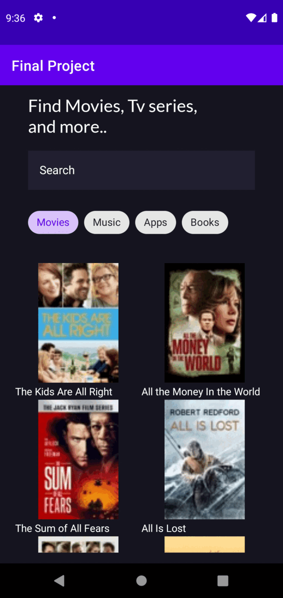

  <h3 align="center" Hepsiburada Android Bootcamp Senior Project</h3>

<!-- ABOUT THE PROJECT -->
## About The Project
This project was developed using MVVM for Hepsiburada Android Bootcamp. In the project, a search screen and a detail page were developed where users can search between movies, music, applications and books.

### Built With
* [Retrofit](https://square.github.io/retrofit/)
* [Navigation Component](https://developer.android.com/guide/navigation)
* [Glide](https://github.com/bumptech/glide)
* [LiveData](https://developer.android.com/topic/libraries/architecture/livedata)
* [OkHttp](https://square.github.io/okhttp/)
* [Coroutines](https://developer.android.com/kotlin/coroutines)
* [Paging3](https://developer.android.com/topic/libraries/architecture/paging/v3-overview)

